# TaskForge

**A production-grade, multi-tenant SaaS project management platform.**

TaskForge is a full-stack project management application built with modern architecture. It features multi-tenant organization management, real-time collaboration via WebSockets, email notifications, and a polished dashboard UI designed for portfolio presentation.

---

## Key Features

### Multi-Tenant SaaS Architecture
- Organization-scoped data isolation enforced at the guard layer
- 4-guard request chain: `Throttler -> JWT -> OrgMembership -> Roles`
- 3-tier membership cache: request-level -> Redis (5 min) -> database
- Role-based access control: `admin` | `member` per organization

### Project & Task Management
- Create and manage projects within organizations
- Kanban board with drag-and-drop task management (To Do / In Progress / Done)
- Task priority levels: low, medium, high, urgent
- Task assignment with due dates and descriptions
- Soft delete with audit trail

### Email Notifications (Nodemailer)
- Professional HTML email templates with plain text fallback
- **Invitation emails** sent when admins invite users to organizations
- **Task assignment emails** sent when tasks are assigned or reassigned
- SMTP configuration via environment variables
- Graceful fallback: logs emails when SMTP is not configured

### Real-Time WebSocket Notifications
- Socket.IO for real-time event broadcasting
- In-app notification center with unread count and bell icon
- Notifications for: task assignments, member joins, and more
- Tenant-aware: notifications never leak across organizations
- Persistent notifications stored in database via API

### Authentication & Security
- JWT access tokens (15 min) + refresh token rotation (7 day)
- Argon2 password hashing
- Token theft detection via family ID revocation
- Redis-backed rate limiting (100 req/min default, 10/min on auth)

### Billing Integration
- Stripe-driven subscription lifecycle
- Entitlements computed from plan + usage counters
- Webhook idempotency via ProcessedWebhook table

### Premium Dashboard UI
- Responsive design (desktop, tablet, mobile)
- Split-panel auth pages with branding
- Dashboard overview with stats cards, task breakdown, and activity feed
- Polished sidebar navigation with search, org switcher, and section labels
- Professional notification dropdown with type icons
- Kanban board with priority badges and avatar assignments
- Command palette (Cmd+K) for quick navigation

---

## Tech Stack

| Layer | Technology |
|-------|-----------|
| **Frontend** | Next.js 15, React 19, TypeScript, Tailwind CSS 4 |
| **State** | Zustand (client state), TanStack React Query (server state) |
| **Realtime Client** | Socket.IO Client |
| **Drag & Drop** | dnd-kit |
| **Backend** | NestJS 11, TypeScript |
| **Database** | PostgreSQL 16, TypeORM |
| **Cache** | Redis 7, ioredis |
| **Queue** | BullMQ (separate worker process) |
| **WebSocket** | Socket.IO via NestJS Gateway |
| **Email** | Nodemailer with SMTP |
| **Billing** | Stripe SDK v22 |
| **Auth** | JWT + Passport + argon2 |
| **Logging** | Pino (structured JSON) |

---

## Project Structure

```
TaskForge/
├── frontend/                    # Next.js 15 App Router
│   └── src/
│       ├── app/                 # Pages (auth, dashboard)
│       ├── components/          # UI components + layout
│       ├── features/            # Feature modules (tasks, projects, orgs)
│       ├── hooks/               # Shared hooks
│       ├── lib/                 # API client, utils, socket
│       ├── store/               # Zustand stores
│       └── types/               # TypeScript interfaces
│
├── backend/                     # NestJS 11 API
│   └── src/
│       ├── modules/
│       │   ├── auth/            # JWT, refresh tokens, login/register
│       │   ├── users/           # User management
│       │   ├── organizations/   # Multi-tenant orgs, memberships, invites
│       │   ├── projects/        # Project CRUD
│       │   ├── tasks/           # Task CRUD with assignment
│       │   ├── activity/        # Audit logging
│       │   ├── realtime/        # WebSocket gateway
│       │   ├── notifications/   # In-app notification system
│       │   ├── mail/            # Nodemailer email service
│       │   ├── billing/         # Stripe subscriptions
│       │   └── health/          # Health checks
│       ├── infrastructure/      # Database, Redis, Queue
│       ├── common/              # Guards, filters, decorators
│       └── shared/              # Enums, interfaces, errors
│
└── UI/                          # Design reference templates (not deployed)
```

---

## Environment Variables

### Backend (.env)

```bash
# Server
PORT=3000
NODE_ENV=development

# Database
DB_HOST=localhost
DB_PORT=5432
DB_USERNAME=postgres
DB_PASSWORD=postgres
DB_NAME=taskforge

# Redis
REDIS_HOST=localhost
REDIS_PORT=6379

# Auth
JWT_SECRET=your-secret-key-at-least-32-characters-long
ACCESS_TOKEN_TTL=15m
REFRESH_TOKEN_TTL=7d

# Email (SMTP) - Optional, logs emails when not configured
SMTP_HOST=localhost
SMTP_PORT=587
SMTP_SECURE=false
SMTP_USER=
SMTP_PASS=
SMTP_FROM=TaskForge <noreply@taskforge.io>

# Stripe (optional in development)
STRIPE_SECRET_KEY=
STRIPE_WEBHOOK_SECRET=
FRONTEND_URL=http://localhost:3001
```

### Frontend (.env.local)

```bash
NEXT_PUBLIC_API_URL=http://localhost:3000
NEXT_PUBLIC_SOCKET_URL=http://localhost:3000
```

---

## Getting Started

### Prerequisites
- Node.js 20+
- PostgreSQL 16+
- Redis 7+

### Backend Setup

```bash
cd backend
cp .env.example .env          # Edit with your credentials
npm install
npm run migration:run         # Create database tables
npm run start:dev             # Start API on port 3000
npm run start:worker:dev      # Start background worker (separate terminal)
```

### Frontend Setup

```bash
cd frontend
cp .env.local.example .env.local
npm install
npm run dev                   # Start on port 3001
```

### Access the App

1. Open `http://localhost:3001`
2. Register a new account
3. Create an organization
4. Start creating projects and tasks

---

## Email Notification Setup

### Using Nodemailer with SMTP

TaskForge uses Nodemailer for transactional emails. Configure SMTP credentials in your backend `.env`:

```bash
SMTP_HOST=smtp.gmail.com      # Or any SMTP provider
SMTP_PORT=587
SMTP_SECURE=false
SMTP_USER=your-email@gmail.com
SMTP_PASS=your-app-password
SMTP_FROM=TaskForge <noreply@yourdomain.com>
```

### Testing with Mailtrap/Ethereal

For development, use [Mailtrap](https://mailtrap.io) or [Ethereal](https://ethereal.email):

```bash
SMTP_HOST=sandbox.smtp.mailtrap.io
SMTP_PORT=2525
SMTP_USER=your-mailtrap-user
SMTP_PASS=your-mailtrap-pass
```

### Email Events

| Event | Email Sent To | Content |
|-------|--------------|---------|
| Admin invites a user | Invited email address | Invitation with accept link |
| Task assigned to user | Assigned user's email | Task title, description, priority, due date |
| Task reassigned | Newly assigned user | Same as above |

When SMTP is not configured, emails are logged to console for development visibility.

---

## WebSocket Notifications

TaskForge uses Socket.IO for real-time notifications:

1. **Connection**: Client connects with JWT token in handshake auth
2. **Rooms**: Users join `user:{id}` (personal) and `org:{orgId}` (team) rooms
3. **Events**: Domain events (task.created, task.updated, member.joined) broadcast to org rooms
4. **Notifications**: Task assignments and member joins create persistent notifications
5. **Frontend**: Bell icon with unread count, dropdown with notification list

### Testing WebSocket Notifications

1. Open the app in two browser windows with different users in the same org
2. Assign a task to the other user
3. The assigned user should see a notification bell badge and notification in the dropdown

---

## API Endpoints

### Authentication
| Method | Path | Description |
|--------|------|-------------|
| POST | `/api/v1/auth/register` | Register new user |
| POST | `/api/v1/auth/login` | Login |
| POST | `/api/v1/auth/refresh` | Refresh tokens |
| GET | `/api/v1/auth/me` | Get current user |
| POST | `/api/v1/auth/logout` | Logout |

### Organizations
| Method | Path | Description |
|--------|------|-------------|
| POST | `/api/v1/organizations` | Create organization |
| GET | `/api/v1/organizations` | List user's orgs |
| POST | `/api/v1/organizations/switch` | Switch active org |
| GET | `/api/v1/organizations/current` | Get current org |
| GET | `/api/v1/organizations/members` | List org members |
| POST | `/api/v1/organizations/invites` | Create invite (admin) |

### Projects & Tasks
| Method | Path | Description |
|--------|------|-------------|
| POST | `/api/v1/projects` | Create project |
| GET | `/api/v1/projects` | List projects |
| POST | `/api/v1/projects/{id}/tasks` | Create task |
| GET | `/api/v1/tasks` | List all tasks |
| PATCH | `/api/v1/tasks/{id}` | Update task |

### Notifications
| Method | Path | Description |
|--------|------|-------------|
| GET | `/api/v1/notifications` | List notifications |
| GET | `/api/v1/notifications/unread-count` | Get unread count |
| POST | `/api/v1/notifications/{id}/read` | Mark as read |
| POST | `/api/v1/notifications/read-all` | Mark all as read |

---

## Testing Guide

### Test Invitation Emails
1. Configure SMTP (or use Mailtrap)
2. Log in as an admin of an organization
3. Go to Organizations > Invite Member
4. Enter an email address and send the invite
5. Check the recipient's inbox (or Mailtrap) for the invitation email

### Test Task Assignment Emails
1. Have at least 2 users in the same organization
2. Create a task and assign it to another user
3. Check the assigned user's email for the task notification
4. Reassign the task to a different user and verify the new user gets notified

### Test WebSocket Notifications
1. Open two browser sessions with different users in the same org
2. In session 1: Create a task assigned to user 2
3. In session 2: See the notification bell badge update
4. Click the bell to see the notification in the dropdown

---

## Portfolio Screenshots

Assets live under [`screenshots/`](screenshots/) for READMEs, résumés, and case studies. Each block below maps to a feature area a reviewer can scan quickly.

### Dashboard & analytics

**Overview** — Stats cards, task flow over time, and status mix.

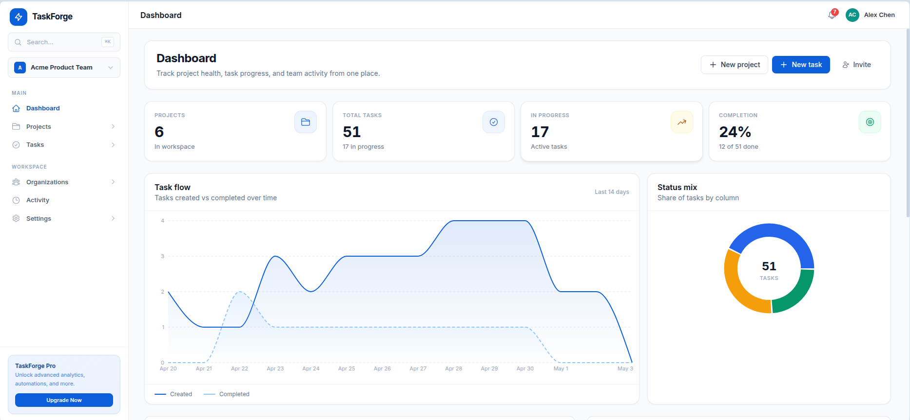

**Operational view** — Workflow health, activity feed, priority mix, deadlines, and “My work.”

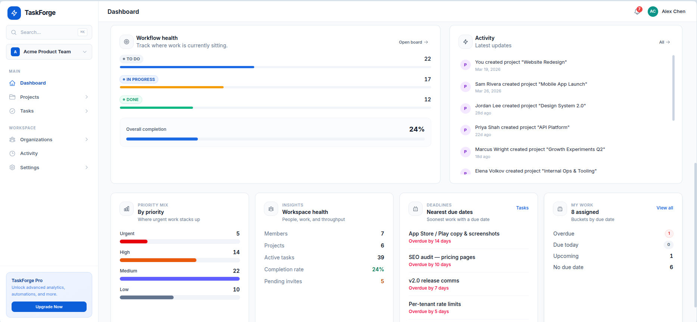

### Projects & tasks

**Project grid** — Workspace projects with search and card layout.

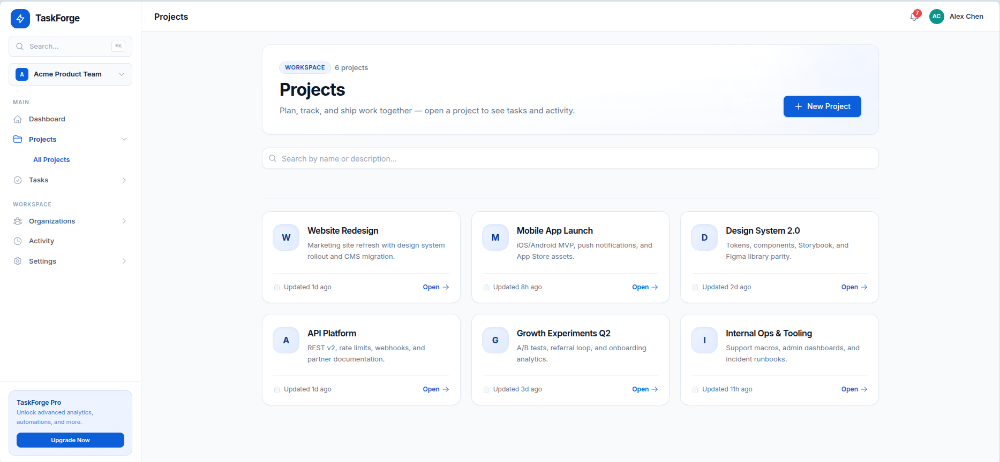

**Project detail** — Single project header with board/table switcher and Kanban columns.

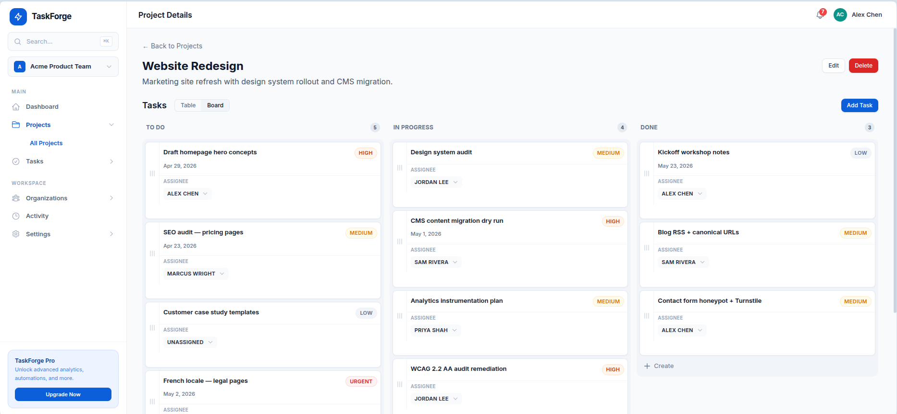

**Workspace task board** — To Do / In Progress / Done with priorities and assignees.

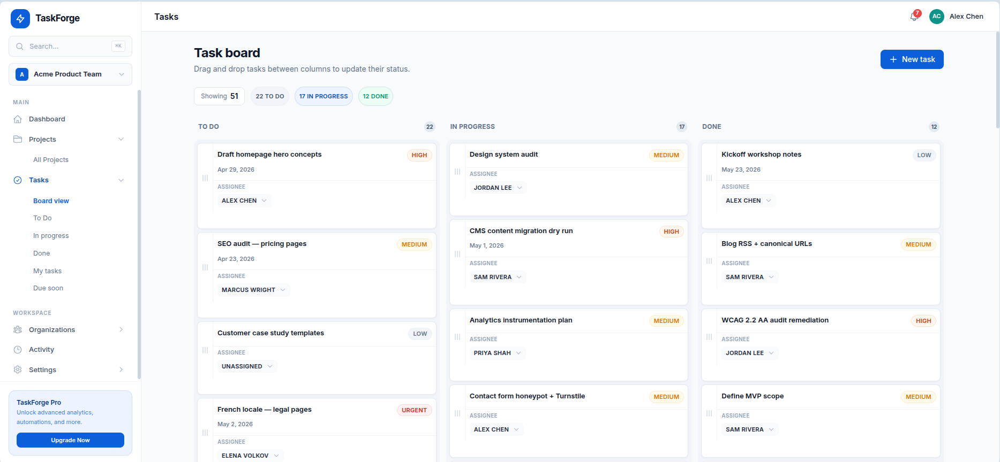

### Organizations & invitations

**Organizations** — Active workspace, metadata, and team access summary.

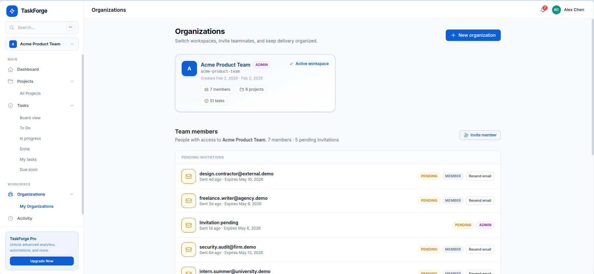

**Team roster** — Members and pending invitations with role badges.

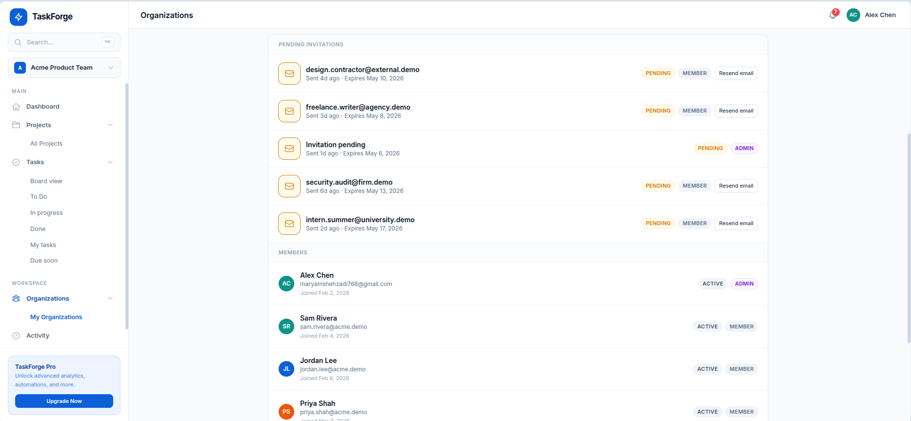

**Invite member** — Modal with email, role, and send invitation.

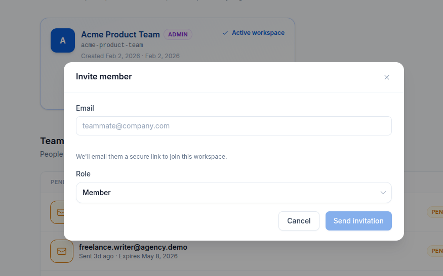

### Notifications

**In-app center** — Unread count, list with icons, and mark-all-read.

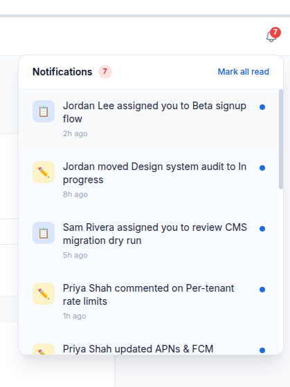

### Authentication

Split-panel auth with shared branding (login, registration, password recovery).

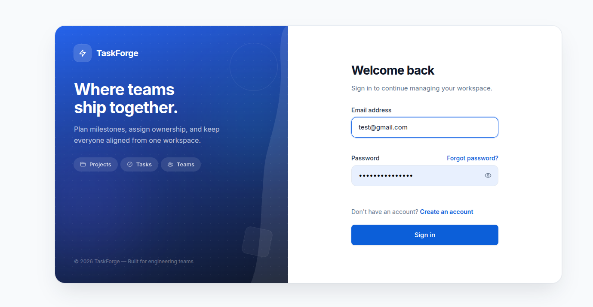

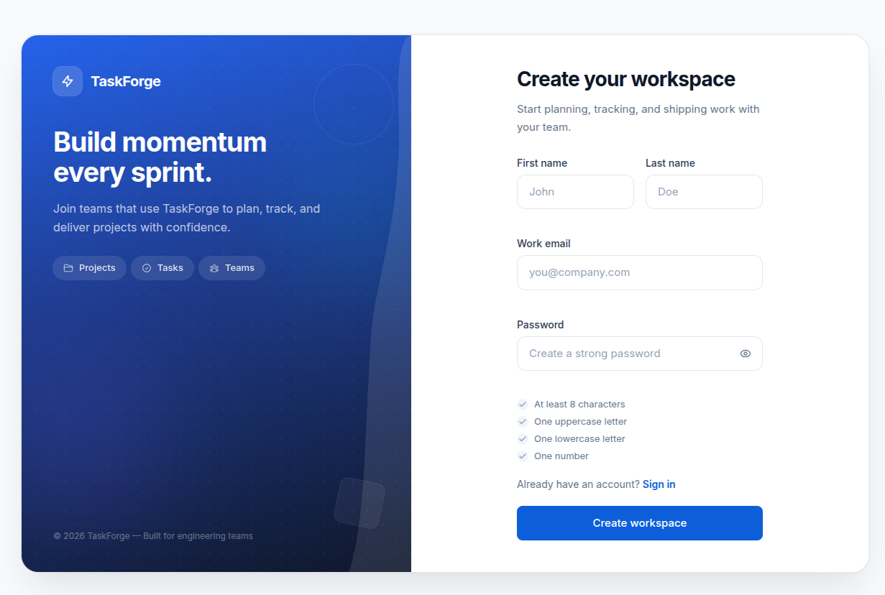

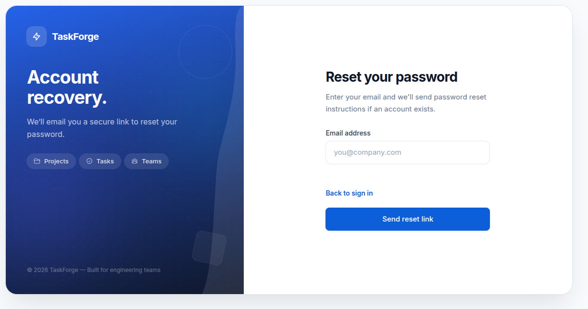

### Mobile & responsive

Same product on narrow viewports: condensed chrome, stacked cards, and touch-friendly actions.

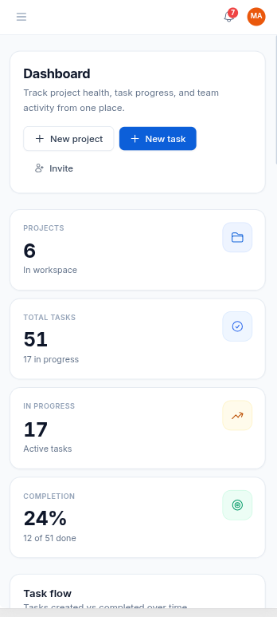

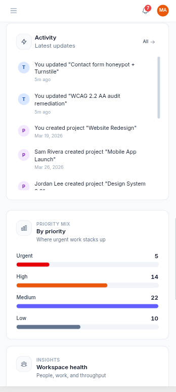

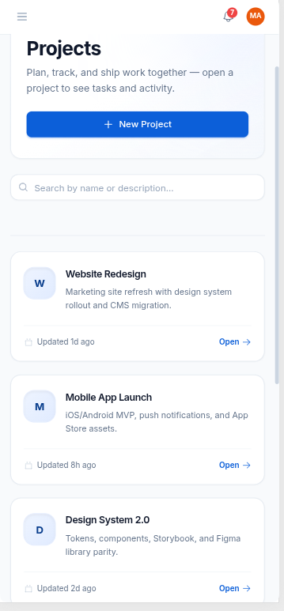

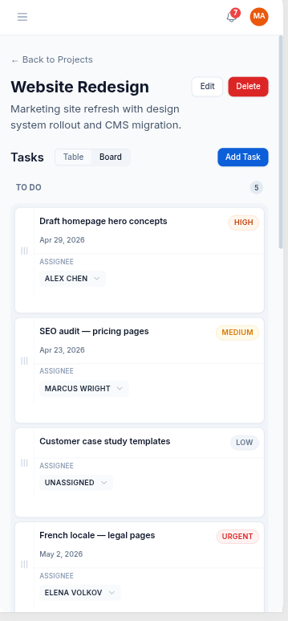

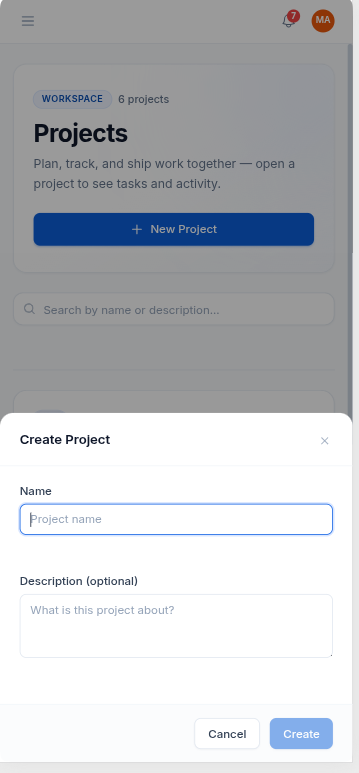

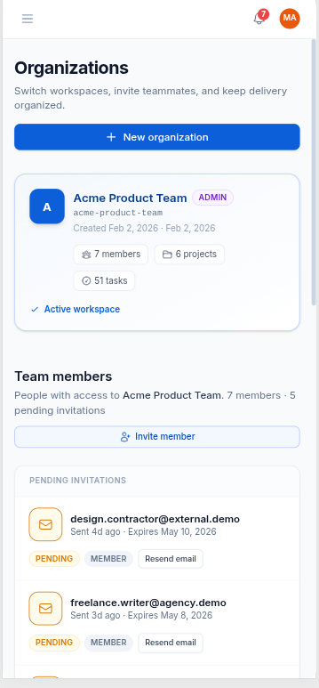

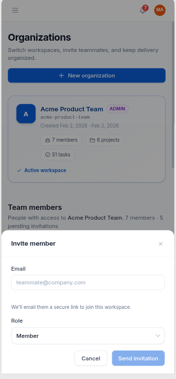

### Optional captures (not in repo)

If you extend this folder later, strong additions are: **Settings** (profile / workspace), and an **invitation or task-assignment email** opened in an inbox or Mailtrap (HTML template proof).

---

## Architecture Highlights

### Request Flow
```
Client -> Next.js -> NestJS API
                        |
                   Guard Chain:
                   Throttler -> JWT -> OrgMembership -> Roles
                        |
                   Service Layer -> PostgreSQL
                        |
                   Domain Event Bus
                    /          \
              BullMQ         Socket.IO
              Queue          Broadcast
                |
              Worker
           (audit log)
```

### Multi-Tenant Isolation
- Organization ID validated at guard layer, not query layer
- Services read org context from validated request, never from user input
- Membership checked with 3-tier cache for performance

### Event-Driven Architecture
- All mutations emit domain events
- Events consumed by: Activity Logger, WebSocket Broadcaster, Notification Creator, Email Sender
- Background worker processes audit log asynchronously

---

## License

MIT
